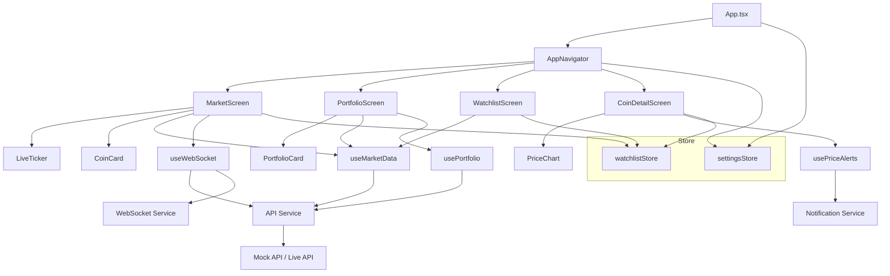

# Crypto Pulse

[](https://expo.dev)
[](https://reactnative.dev)
[](https://www.typescriptlang.org)
[](https://github.com/pmndrs/zustand)
[](LICENSE)

**Crypto Pulse** — A real-time cryptocurrency portfolio tracker built with React Native (Expo). Track prices, manage your portfolio, set price alerts, and stay on top of the market.

## Screenshots

| Market | Coin Detail | Portfolio | Watchlist |
|--------|-------------|-----------|-----------|
|  |  |  |  |

> Screenshots are placeholders. Replace `assets/screenshot-*.png` with actual screenshots.

## Features

- **Live Ticker** — Auto-scrolling horizontal price bar with real-time WebSocket updates
- **Market Screen** — Infinite-scroll list of top cryptocurrencies with search
- **Coin Detail** — Price chart (7-day sparkline), market stats, watchlist toggle
- **Portfolio** — Track holdings, P&L, and total value with mock data (swap-ready for real API)
- **Watchlist** — Star your favorite coins for quick access
- **Price Alerts** — Background notifications when prices cross thresholds
- **Dark Mode** — NativeWind dark mode, toggled and persisted via Zustand
- **WebSocket** — Auto-reconnect with exponential backoff
- **Mock API** — Docker Compose for a local JSON API server

## Tech Stack

| Layer | Technology |
|-------|-----------|
| Framework | React Native (Expo 52) |
| Language | TypeScript 5.3 |
| Navigation | React Navigation 7 (Tab + Stack) |
| State | Zustand 5 + Persist |
| Styling | NativeWind 4 (Tailwind CSS) |
| Charts | react-native-chart-kit + react-native-svg |
| Animations | React Native Animated API + Reanimated 3 |
| Notifications | expo-notifications + expo-task-manager |
| HTTP | Fetch (with mock/real API switch) |
| Backend | json-server via Docker Compose |

## Architecture



## Quick Start

### Prerequisites

- Node.js 18+
- npm or yarn
- [Expo Go](https://expo.dev/client) on your phone (or an emulator)
- Docker (optional, for mock API)

### Setup & Run

```bash
# Clone and install
cd crypto-pulse-app
npm install

# Start the mock API (optional)
docker compose up -d

# Start Expo
npx expo start
```

Scan the QR code with Expo Go, or press `a` for Android emulator / `i` for iOS simulator.

### Configuration

Copy `.env.example` to `.env` and adjust:

```env
EXPO_PUBLIC_API_URL=http://localhost:3001
EXPO_PUBLIC_WS_URL=ws://localhost:3001/ws
EXPO_PUBLIC_MOCK_API=true
```

Set `EXPO_PUBLIC_MOCK_API=false` to connect to a real API (e.g., CoinGecko).

## Running Tests

```bash
npx jest
```

Tests cover:
- `usePortfolio` hook — calculates total value correctly
- `CoinDetail` screen — renders chart data after loading
- `WatchlistStore` — persists add/remove actions
- `MarketScreen` — infinite scroll triggers next page
- Notification service — triggers when price crosses threshold

## Project Structure

```
crypto-pulse-app/
├── App.tsx                      # Root component
├── src/
│   ├── components/              # Reusable UI components
│   │   ├── LiveTicker.tsx       # Auto-scrolling price ticker
│   │   ├── CoinCard.tsx         # Market list item
│   │   ├── PortfolioCard.tsx    # Portfolio summary card
│   │   ├── PriceChart.tsx       # 7-day price chart
│   │   └── LoadingState.tsx     # Loading spinner
│   ├── screens/                 # App screens
│   │   ├── MarketScreen.tsx     # Main market list
│   │   ├── CoinDetailScreen.tsx # Individual coin detail
│   │   ├── PortfolioScreen.tsx  # Portfolio overview
│   │   └── WatchlistScreen.tsx  # Starred coins
│   ├── hooks/                   # Custom React hooks
│   │   ├── useMarketData.ts     # Paginated coin data
│   │   ├── usePortfolio.ts      # Portfolio calculation
│   │   ├── useWebSocket.ts      # WebSocket connection
│   │   └── usePriceAlerts.ts    # Price alert management
│   ├── store/                   # Zustand state stores
│   │   ├── watchlistStore.ts    # Persisted watchlist
│   │   └── settingsStore.ts     # Theme & settings
│   ├── services/                # API & utilities
│   │   ├── api.ts               # HTTP client
│   │   ├── websocket.ts         # WebSocket manager
│   │   └── notifications.ts     # Push notifications
│   ├── types/index.ts           # TypeScript definitions
│   ├── constants/index.ts       # Constants & mock data
│   └── navigation/AppNavigator.tsx
├── __tests__/                   # Test files
├── docker-compose.yml           # Mock API setup
└── package.json
```

## Mock API

The app includes a `docker-compose.yml` with a json-server mock API:

```bash
docker compose up -d
```

Endpoints:
- `GET /coins` — List of cryptocurrencies
- `GET /coins/:id` — Single coin detail
- `GET /portfolio` — Portfolio data
- `GET /price_history/:coinId` — Historical prices

## License

[MIT](LICENSE)
